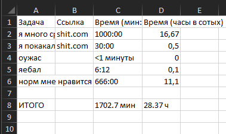

# worktimer gui
 [wrktmr022.7.zip](https://github.com/ashtray01/wrktmr/releases/download/022.7/wrktmr022.7.zip)
 в новой версии добавлен интерфейс
 также переработаны некоторые механики
 

# worktimer terminal
routine manager in terminal
 менеджер задач в терминале
 
 Вводи задачи.
 Для завершённых задач начни с **!**
 
 Команды:
 :h — завершить день (сохранить Excel и выйти)
 :s — сохранить Excel
 :q — выйти (с сохранением Excel)
 :e1 — редактировать задачу №1
 :d1 — удалить задачу №1 (с подтверждением)
 :da — удалить все задачи (с подтверждением)
 :stats — показать статистику  
 Выход через CTRL-C автоматически сохранит таблицу.
 Все задачи сохраняются YYYY-MM-DD.txt на рабочий стол в папку logs.
 Сортировка по дате в папках на рабочем столе: .\logs\2025\08\15\2025-08-15.xlsx
 

